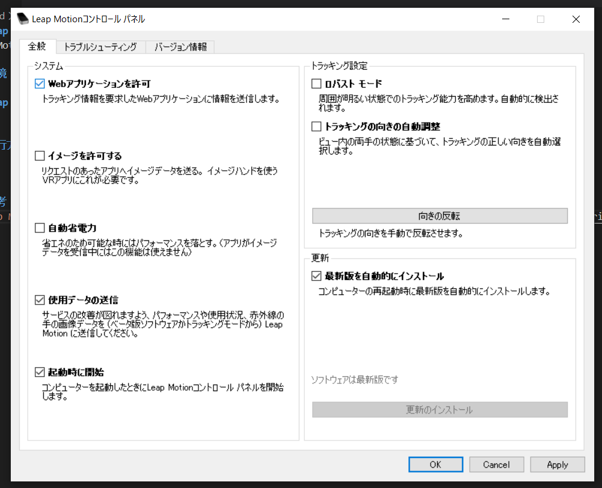

# Leap Motion UDP Sender
LeapMotion の コマンドを UDP で送信するアプリ

# 環境
LeapMotion と node.js 環境があれば動作する。
- Windows 10  
LeapMotion V4 SDKは osx 未対応
- LeapMotion [V4 SDK](https://developer.leapmotion.com/setup/desktop)  
LeapMotion 利用に必要なドライバや設定変更やボーン表示ソフト
- [node.js](https://nodejs.org/en/)  
npm node 等 必要コマンド

# Leap Motion コントローラー設定
`Webアプリケーションを許可` を有効にする


# 実行方法
```
npm i
npm run app [送信先IPアドレス 省略時 127.0.0.1]
npm run app 192.168.86.29

```


# 仕様
LeapMotionコントローラーの設定 `Webアプリケーションを許可` をすると WebSocket サーバ起動するのでそれを利用している


# 参考
[Leap Motion と JavaScript でハンドパワー駆動のウェブページ](https://www.ei.tohoku.ac.jp/xkozima/lab/leapTutorial1.html)